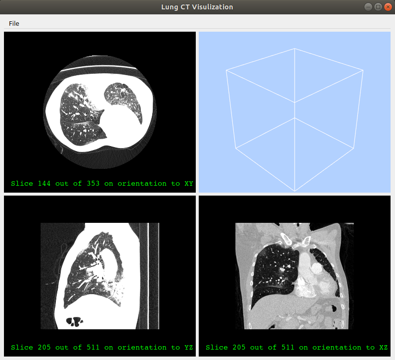

# COVID19_VIS

Update:

* A framework to combine vtk interactive windows to QT window, as in ``SubWindow`` class.
* A 3d volume rendering for lung part, needing masks as input. Result shown as below.
* Finished 2d views with interactions.
* Load data by UI, bugs here.

Bugs:

* vtkNIFTIImageReader.SetInputData not working.
* Camera behaves weird after loading