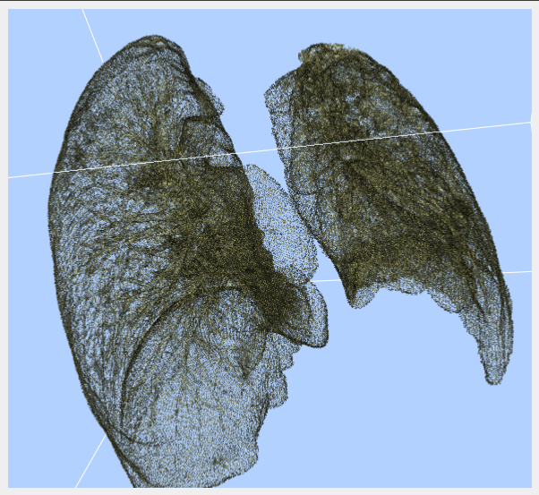

# COVID19_VIS

Update:

* A framework to combine vtk interactive windows to QT window, as in ``SubWindow`` class.
* A 3d volume rendering for lung part, needing masks as input. Result shown as below.

Bugs:

* 2d Windows
* Add input port to vtkNIFTIImageReader initially?
* Camera behaves weird after loading